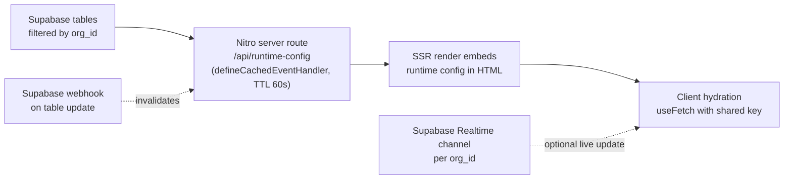

# Template Config: Repo vs Supabase Split

> Strategic doc for how this template splits configuration between build-time
> (the repo: `data/common.json`, env, code) and runtime (Supabase) so the
> dashboard can edit branding, products, and quizzes without forcing a redeploy
> for every change, while keeping SEO, CSP, fonts, and bundle integrity solid.
>
> **Related docs:**
> - [SUPABASE_SCHEMA.md](./SUPABASE_SCHEMA.md) — exact table definitions to provision in Supabase
> - [SUPABASE_WEBHOOKS.md](./SUPABASE_WEBHOOKS.md) — how to wire instant cache invalidation
> - [ARCHITECTURE.md](./ARCHITECTURE.md) — overall system overview

## Guiding Principles

1. **Build-time stays in repo** for anything that (a) must appear in the initial HTML before JS hydrates, (b) gets compiled into the bundle, (c) is a binary asset, or (d) is type-safe code (functions, discriminated unions). This protects SEO, social previews, CSP, and tree-shaking.
2. **Runtime goes to Supabase** for anything that is pure data, changes often, and is acceptable to fetch on the SSR render. The dashboard updates a row; users see the change on the next request (or live via Supabase Realtime) without waiting for a Vercel rebuild.
3. **Dual-write where it's worth it**. A few items (brand colors, defaultQuizId) live in BOTH places: repo holds the default that gets baked into the build; Supabase holds a runtime override. The dashboard can offer "publish instantly" vs "save for next deploy" semantics on these.
4. **Multi-tenant via `org_id` everywhere in Supabase**. Each deployment is stamped at build time with its `NUXT_PUBLIC_ORG_ID`; every Supabase query filters by it; RLS policies enforce isolation.
5. **Dashboard has two write paths**: GitHub commit (binary assets, code-level changes) and Supabase mutation (runtime data). Dashboard logic picks the right path per setting.

## Decision Rubric

For every config item, ask: does it satisfy ANY of these → **REPO**:
- Required in HTML `<head>` before hydration (SEO meta, `<title>`, GTM script, favicon link, OG/Twitter cards)
- Affects build artifacts (Tailwind color compilation, `@font-face` declarations in CSS, CSP `frame-ancestors` header)
- Binary asset (font files, images, logo, favicon)
- Type-safe code (Vue components, validators, renderCondition functions)
- Gates which code paths get bundled (e.g. `USE_NEW_API` switches the builder)
- Secret (API key)

Otherwise → **SUPABASE**.

## Mapping

### Stays in repo (build-time)

- **`.env`** — secrets and build-time flags only:
  - `CARE_VALIDATE_API_KEY_*`, `STRIPE_PUBLISHABLE_KEY_*`, `CARE_VALIDATE_API_URL_*` (secrets / deploy-env-specific)
  - `GTM_CONTAINER_ID` (must be in `<head>` pre-hydration; rebuild on change is acceptable since GTM containers are updated in-place anyway via GTM dashboard)
  - `USE_NEW_API` (decides which builder is bundled — a build-time decision)
  - `NUXT_PUBLIC_EMBED_ALLOWED_ORIGINS` (server sets CSP `frame-ancestors` on every response; fetching from Supabase per-request is expensive)
  - `NUXT_PUBLIC_FINGERPRINT_API_KEY` (public but build-time)
  - New: `NUXT_PUBLIC_ORG_ID` (stamps this deployment so Supabase queries can filter)

- **[data/common.json](data/common.json)** — brand identity for build-time:
  - `brand.orgName` (used in SEO `<title>`, OG tags, policy page interpolations — must be in initial HTML)
  - `brand.colors` (Tailwind reads these at build to generate utility classes)
  - `brand.fonts.bodyFile` / `brand.fonts.headingFile` (referenced by `@font-face` rules in `assets/css/main.css`)
  - `strings.siteTitle`, `strings.pageDescription` (SEO meta tags)
  - `quiz.defaultQuizId` (so first paint of `/consultation` knows which quiz to load; Supabase can still override at runtime for hot-swap)
  - Drop: `announcement` block moves out (see below)

- **[assets/fonts/](assets/fonts/)**, **[public/](public/)** — binary assets (fonts, favicon, logo)

- **[pages/terms.vue](pages/terms.vue)**, **[pages/privacy.vue](pages/privacy.vue)**, **[pages/medical-consent.vue](pages/medical-consent.vue)**, **[pages/privacy-practices.vue](pages/privacy-practices.vue)** — legal-reviewed templates; `{{ orgName }}` interpolation only

- **[data/formSteps.ts](data/formSteps.ts)** + **[data/quizConfigs.ts](data/quizConfigs.ts)** — quiz TEMPLATES with all logic (renderCondition, disqualifyCondition, validators, displayValue). These become the "starting points" your team uses; Supabase holds per-org instances that override text/structure but reference the template's logic by step/question key.

- **[utils/buildFormPayload.ts](utils/buildFormPayload.ts)** + **[utils/buildFormPayloadNew.ts](utils/buildFormPayloadNew.ts)** — payload builders; can't be serialized.

### Moves to Supabase (runtime)

- Announcement bar (enabled flag + text + link + colors) — currently `data/common.json:announcement`
- Product catalog: categories, products, variations, pricing, active/inactive toggles, product → quiz mapping — currently [data/intake-form/productsList.json](data/intake-form/productsList.json)
- Quiz instances: name, description, progress steps, per-step heading/subtext overrides, per-question text/options overrides — overlays on top of code templates
- `NUXT_PUBLIC_BNPL_ACTIVATED` → `site_config.bnpl_activated`
- `NUXT_PUBLIC_HOME_URL` → `site_config.home_url`
- `NUXT_PUBLIC_EF_BASE_URL`, `NUXT_PUBLIC_EF_API_KEY`, future Everflow `offer_id` / `event_id` → `site_config.everflow_*`
- `defaultQuizId` (runtime override; falls back to `common.json` value)
- Landing page sections (when the landing page feature ships)

## Multi-Tenant Stamping

Each Vercel deployment is one client. To bind a deployment to its Supabase rows:

- Set `NUXT_PUBLIC_ORG_ID=<uuid>` per Vercel project (the dashboard sets this when provisioning the deployment)
- Replace the stub [data/hostTemplate.json](data/hostTemplate.json) with a richer per-deployment manifest:

```json
{ "orgId": "<uuid>", "templateName": "Hair Loss Template v1", "createdAt": "..." }
```

- A new server util `useOrgId()` reads `runtimeConfig.public.orgId` and is used by every Supabase fetch
- Enable Supabase RLS so `org_id` filtering is enforced at the DB layer, not just app code

## Supabase Schema Sketch

Every table has `org_id uuid not null` + RLS policy `org_id = current_setting('app.org_id')`.

```
site_config           (singleton per org)
  org_id, bnpl_activated, home_url, default_quiz_id_override,
  everflow_offer_id, everflow_event_id, use_new_api_override, updated_at

announcement
  org_id, enabled, text, link, background_color, text_color, updated_at

product_categories
  org_id, id (slug), name, main_image_path, availability,
  sort_order, active, updated_at

products
  org_id, id (slug), category_id, name, selection_name, intro, type,
  main_image_path, tag, description, quiz_id, availability, active,
  sort_order, updated_at

product_variations
  id (uuid = variation id), org_id, product_id, bundle_id,
  duration, price, refill_price, sort_order, updated_at

quizzes                          (overrides for template instances)
  org_id, id (slug, matches template), template_id, name, description,
  progress_steps (jsonb), updated_at

quiz_step_overrides              (Phase 3)
  org_id, quiz_id, step_key (matches code), sort_order,
  heading, subtext, enabled, updated_at

quiz_question_overrides          (Phase 3)
  org_id, quiz_id, step_key, question_key (matches code),
  question_text, options (jsonb), updated_at

landing_page_sections            (Phase 4)
  org_id, section_key, sort_order, content (jsonb), updated_at
```

## Fetch & Cache Strategy



Key details:
- One Nitro endpoint per concern: `/api/runtime-config`, `/api/products`, `/api/quiz/[id]/overrides`. Each is a `defineCachedEventHandler` keyed by org_id with a short TTL.
- Supabase webhooks on writes call a `/api/cache-invalidate` endpoint that clears the relevant Nitro cache key — gives near-instant publish.
- For high-frequency reads (announcement, products) the cache TTL is the safety net; the webhook is the fast path.
- Realtime channel subscription is optional and additive — useful for dashboard live preview, not required for end users.
- Hard fallback: if Supabase is down, the cached snapshot serves until TTL expires; after that, the page renders using only `common.json` defaults. No total outage.

## Refinements (post-review)

- **`USE_NEW_API` moves to Supabase**: both payload builders are already bundled, so the runtime flag is no more bytes than today; gain is being able to flip between APIs without redeploy. Adds `use_new_api` column to `site_config`.
- **This app is a pure READER of Supabase.** The dashboard (separate app) owns schema migrations and all writes. This repo never runs `supabase` CLI, never owns `supabase/migrations/`, never seeds rows. Schema is documented in this repo as a reference contract (`docs/SUPABASE_SCHEMA.md`), but the actual DB is provisioned and maintained out-of-band by the dashboard team.
- **Supabase project provisioning is manual** and out of scope for this work. User sets up the Supabase project + tables + initial row themselves. This Phase 1 produces the reader code that will start working as soon as `.env` is populated with Supabase URL + anon key + org_id matching a real row.
- **Cache invalidation webhook endpoint is built but dormant** until the user configures the corresponding Supabase Database Webhook. Until then, runtime config refreshes via 60s TTL on the Nitro cache (acceptable for almost everything; instant publish wakes up once the webhook is wired).
- **Products approach (Phase 2 preview)**: when product pages get built for SEO, use Nuxt/Nitro **ISR** (`routeRules: { '/products/**': { isr: 60 } }`) on top of Supabase. Pre-rendered, edge-cached, dashboard publish → webhook → on-demand revalidation. Same SEO posture as repo-backed pages with none of the rebuild cost. Don't keep products in the repo "for SEO" — SSR'd Supabase data is just as crawlable.

## Phased Migration

### Phase 0 — Document the split (no code changes)
- Land this plan as `docs/CONFIG_SPLIT.md`
- Update [docs/ARCHITECTURE.md](docs/ARCHITECTURE.md) to reference it
- Clean up the few lingering dormant env vars

### Phase 1 — Reader machinery (revised: no migrations, no CLI, no seed)

This app only READS from Supabase. Schema + writes are owned by the dashboard. Phase 1 ships the reader, the cache, and the document that pins the contract.

1. Install `@supabase/supabase-js`. Rework `.env` to add `NUXT_PUBLIC_SUPABASE_URL`, `SUPABASE_ANON_KEY`, `SUPABASE_SERVICE_ROLE_KEY`, `SUPABASE_WEBHOOK_SECRET`, `NUXT_PUBLIC_ORG_ID`; remove `NUXT_PUBLIC_BNPL_ACTIVATED`, `USE_NEW_API`, `NUXT_PUBLIC_HOME_URL`. Rework `nuxt.config.ts` runtimeConfig in parallel. Remove `announcement` from `data/common.json` and its slot in the `CommonData` type.
2. `server/utils/supabase.ts` (service-role client factory) + `server/utils/orgId.ts` (reads `runtimeConfig.public.orgId`).
3. `server/api/runtime-config.get.ts` — `defineCachedEventHandler` (TTL 60s, key includes org_id). Fetches `site_config` + `announcement` in parallel, returns typed `{ siteConfig, announcement }`. On Supabase failure or missing row, returns `DEFAULT_RUNTIME_CONFIG` so the app never blanks out.
4. `server/api/runtime-config/invalidate.post.ts` — webhook target. Verifies shared-secret header, busts the Nitro cache key. Dormant until the user configures a Supabase Database Webhook to call it.
5. `types/runtime-config.ts` — typed `SiteConfig`, `AnnouncementConfig`, `RuntimeConfigDB`, plus `DEFAULT_RUNTIME_CONFIG` (matches today's behavior so nothing breaks if DB is empty).
6. `plugins/01.runtime-config.ts` — universal plugin. `await useFetch('/api/runtime-config', { key })`. Stores in `useState`.
7. `composables/useRuntimeConfigDB.ts` — synchronous accessor returning the typed `useState` ref.
8. Migrate consumers: `utils/submitPatientForm.ts` (`useNewAPI`), `composables/useEverflow.ts` (Everflow IDs), announcement render site (`components/layout/AnnouncementBar.vue` + `app.vue` height var), `homeUrl` callers.
9. Tests: drop announcement assertions from `test/unit/common-json.spec.ts`. Add `test/unit/runtime-config.spec.ts` (default fallback, server route shape, Supabase outage path).
10. Docs:
    - `docs/CONFIG_SPLIT.md` — canonical copy of this plan for the repo.
    - `docs/SUPABASE_SCHEMA.md` — the contract: SQL CREATE TABLE statements + column doc + RLS policy recommendations + example INSERT for an initial org. The dashboard team uses this to provision matching tables; this app uses it as the type-source-of-truth.
    - `docs/SUPABASE_WEBHOOKS.md` — how to point a Supabase Database Webhook at the `/invalidate` endpoint (header + URL).
11. Verify: `npm run build`, `npx vitest run`, lint sweep.

### Phase 2 — Product catalog
1. Schema for `product_categories`, `products`, `product_variations`
2. Seed from current `productsList.json`
3. Rewrite [data/products.ts](data/products.ts) to read from `/api/products` (cached) instead of importing JSON
4. Verify all call sites in [composables/usePatientForm.ts](composables/usePatientForm.ts), [pages/checkout.vue](pages/checkout.vue), [composables/useCheckout.ts](composables/useCheckout.ts), [components/checkout/VariationSelection.vue](components/checkout/VariationSelection.vue) still work
5. Dashboard product active/inactive toggles work without redeploy
6. Delete `data/intake-form/productsList.json` once parity is confirmed

### Phase 3 — Quiz overrides (text + structure only; logic stays in code)
1. Schema for `quizzes`, `quiz_step_overrides`, `quiz_question_overrides`
2. Modify [data/quizConfigs.ts](data/quizConfigs.ts) so `getQuizById(id)` composes: (a) load template steps from code, (b) fetch overrides from Supabase by `org_id + quiz_id`, (c) merge override text/options into the resolved `QuizConfig`
3. Add a TypeScript "overridable" marker on question types so editor knows what's safe to edit
4. Dashboard quiz editor surface: text fields, option editor, drag-to-reorder steps. Cannot create new question types (those must be added via code PR)
5. Keep `formSteps.ts` as the canonical template source — dashboard "duplicate from template" creates a quiz row + override rows

### Phase 4 — Landing page (when feature ships)
1. Schema for `landing_page_sections`
2. Build `pages/index.vue` (currently a stub) backed by this table
3. Dashboard rich-text editor per section

## Specific Recommendations on Your Listed Items

- **Company name / tab title / policy pages** → `data/common.json:brand.orgName` (repo). Already there. SEO + policy interpolation need it pre-hydration. Dashboard edits = GitHub commit. Acceptable since it changes once at client launch.
- **Company description** → `data/common.json:strings.pageDescription` (repo). Same reasoning.
- **Brand colors** → `data/common.json:brand.colors` (repo). Tailwind compiles these. Edit = GitHub commit + rebuild. If you want INSTANT color tweaks, dual-write the colors to `site_config.color_overrides` as runtime CSS variable overrides — Tailwind classes still work, the CSS vars they reference get overridden at runtime by the brand-tokens plugin. This is a moderate addition; skip unless live color editing is a real requirement.
- **Favicon, logo, fonts** → repo (`public/`, `assets/fonts/`). Binary assets. Dashboard uploads via GitHub API. Already the established pattern with `data/fonts.server.ts`.
- **Announcement bar content** → Supabase (`announcement` table). High edit frequency, runtime is fine.
- **`defaultQuizId`** → repo default + Supabase override. The repo value is what `common.json` already holds; the override lives in `site_config`. Cleanest of both worlds.
- **Products active/inactive** → Supabase (`products.active`).
- **Quiz question editing** → Supabase overrides; code templates stay authoritative for logic and shape. Dashboard cannot create new question TYPES without a code PR (this is the right line to draw — types are bound to Vue components).
- **`GTM_CONTAINER_ID`** → keep in env (repo). It must inject the GTM script into `<head>` pre-hydration. Fetching from Supabase delays GTM initialization and risks losing the first pageview signal. Edits happen rarely; rebuild is acceptable.
- **Everflow offer/event IDs** → Supabase (`site_config.everflow_*`). High frequency per-campaign.

## Things I Specifically Recommend Against

- **Putting `USE_NEW_API` in Supabase**: it gates which builder gets bundled. Externalizing it means both builders are always bundled — extra bytes for users — for a flag that flips once per deployment lifecycle. Keep in env.
- **Putting `NUXT_PUBLIC_EMBED_ALLOWED_ORIGINS` in Supabase**: it sets the CSP `frame-ancestors` header on every response. Per-request Supabase read for a header is wasteful. Keep in env.
- **Putting fonts in Supabase**: Supabase Storage CAN host files, but `@font-face` URLs are baked into CSS at build time. Runtime font swaps require either rebuilding the CSS or using a CSS-in-JS workaround, both messy. Keep fonts as repo binaries, dashboard uploads via GitHub API.
- **Putting policy-page text in Supabase**: legal review needs version-controlled diffs. Keep in [pages/terms.vue](pages/terms.vue) / [pages/privacy.vue](pages/privacy.vue).
- **Pure-Supabase quiz logic without a DSL**: `renderCondition` functions like `(answers) => answers.gender === "Female"` can't be JSON. Even with Phase 3 in scope, keep logic in code and edit only text/structure from the dashboard.

## Open Decisions

1. **Color hot-swap**: do you want live brand-color editing (dashboard publishes → users see new colors without rebuild), or is rebuild-on-color-change acceptable? Determines whether to add `site_config.color_overrides` and runtime CSS-var injection.
2. **Cache invalidation latency**: how fast does an announcement update need to reach users? Choose: (a) ≤1 min via TTL-only, (b) ≤5s via Supabase webhook → invalidate, (c) ~real-time via Supabase Realtime subscription on the client. Each is more infra than the last.
3. **Template versioning for quizzes**: when a code template updates (e.g. `glp1Steps` adds a new question), do existing per-org overrides auto-pick up the new question, or are they pinned to a template version? Affects migration safety.
4. **Dashboard auth**: any plan for how the dashboard authenticates to GitHub + Supabase? Supabase service-role key in dashboard server, GitHub App vs PAT? Influences whether the dashboard touches this app's repo via PR or direct commit.
5. **Org-specific quiz inclusion**: today every org gets every quiz registered in [data/quizConfigs.ts](data/quizConfigs.ts). Should Supabase have a `quizzes_enabled` per org so a hair-loss-only client doesn't see weight-loss in their dashboard?

## File-level Action Items (when you're ready to implement)

- New: `composables/useOrgId.ts`, `composables/useRuntimeConfigDB.ts`, `composables/useProductsDB.ts`, `server/api/runtime-config.get.ts`, `server/api/products.get.ts`, `server/api/cache-invalidate.post.ts`, `server/utils/supabase.ts`, `docs/CONFIG_SPLIT.md`
- Modified: [nuxt.config.ts](nuxt.config.ts) (add `orgId` to public), [data/common.json](data/common.json) (remove `announcement`), [data/products.ts](data/products.ts) (DB-backed), [data/quizConfigs.ts](data/quizConfigs.ts) (overlay overrides), [composables/usePatientForm.ts](composables/usePatientForm.ts) + [pages/checkout.vue](pages/checkout.vue) (async product reads if needed)
- Deleted (Phase 2): [data/intake-form/productsList.json](data/intake-form/productsList.json)
