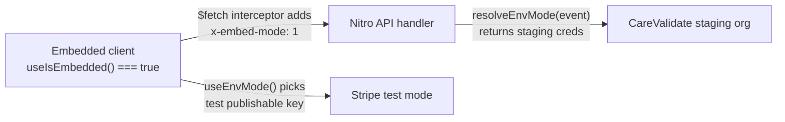

# Iframe Embedding

This app supports being embedded in a cross-origin iframe by explicitly allowlisted parent domains. This document covers how to grant a domain embed access, known limitations of the embed flow, and a step-by-step verification checklist.

## Granting a parent domain embed access

The allowlist is controlled by a single env var:

```sh
NUXT_PUBLIC_EMBED_ALLOWED_ORIGINS=https://partner.example.com,https://another-partner.com
```

Rules:

- Comma-separated. Whitespace around each entry is ignored.
- Each entry must be a full origin (`https://host[:port]`). No paths, no trailing slash.
- `'self'` is implicit — same-origin framing always works without configuration.
- Leaving it empty means cross-origin framing is blocked (same-origin only).

The list is compiled into the `Content-Security-Policy: frame-ancestors` response header at server start in [nuxt.config.ts](../nuxt.config.ts). Changes require a restart.

To verify the header is set correctly after deploy:

```sh
curl -I https://your-deploy-url/ | grep -i content-security-policy
# Expected: content-security-policy: frame-ancestors 'self' https://partner.example.com;
```

## Embed traffic always hits staging

When the app detects it's running inside an iframe, it automatically switches **both sides of the stack** to staging:

- **Client-side**: [composables/useStripe.ts](../composables/useStripe.ts) loads Stripe.js with the test publishable key, so every card entered inside an embed goes through Stripe's test mode. No real charges ever occur from an embedded session.
- **Server-side**: all `/api/*` calls that touch CareValidate use the staging org's API key and staging API URL (see [server/utils/envMode.ts](../server/utils/envMode.ts)). Cases created from an embedded session land in staging, not production.

The signal flows like this:



Same behaviour applies when `NODE_ENV=development` — dev builds and embed builds share the same staging routing. Useful properties:

- A prod build served from a partner's embed still writes to staging. No code rebuild needed.
- A prod build accessed directly (not in an iframe) keeps talking to production.
- The `x-embed-mode: 1` header is set by [plugins/embed-api-headers.client.ts](../plugins/embed-api-headers.client.ts) — it's trivially spoofable, but that's deliberately OK: the worst a spoofer can do is write junk to the staging org, which is strictly less harmful than writing to prod.

**Required env vars** (all must be set for embed routing to work cleanly):

```sh
STRIPE_PUBLISHABLE_KEY_STAGING=pk_test_...
STRIPE_PUBLISHABLE_KEY_PROD=pk_live_...
CARE_VALIDATE_API_KEY_STAGING=...
CARE_VALIDATE_API_KEY_PROD=...
CARE_VALIDATE_API_URL_STAGING=https://api-staging.care360-next.carevalidate.com/api/v1/dynamic-case
CARE_VALIDATE_API_URL_PROD=https://api.care360-next.carevalidate.com/api/v1/dynamic-case
```

Verify server-side routing with a test request:

```sh
curl -H 'x-embed-mode: 1' http://localhost:3000/api/validate-promo?code=TEST
# Server logs should show "[submit-form] Embedded request → routing to staging CareValidate org"
# (for POST /api/submit-form; other endpoints route silently)
```

## Known limitations inside an embed

These are intentional tradeoffs for the MVP embed, not bugs:

### 1. BNPL (Klarna / Affirm) is disabled

When the app detects it's running inside an iframe (`window.self !== window.top`), the Buy Now Pay Later payment option is hidden in [components/checkout/PaymentStep.vue](../components/checkout/PaymentStep.vue) and the corresponding code path in [pages/checkout.vue](../pages/checkout.vue) is guarded.

**Why**: BNPL requires a full-page redirect to Stripe → Klarna/Affirm and back to `/checkout?payment_intent=...`. Inside an iframe that redirect happens within the frame only, and cross-origin storage partitioning (Safari ITP, Chrome Storage Partitioning, Firefox dFPI) makes the return trip unreliable. Card payments work without any redirect and stay entirely inside the iframe.

**Impact for partners**: any plan longer than monthly still displays but only with the card payment option.

### 2. `localStorage` is partitioned per parent origin

Modern browsers partition storage for cross-origin iframes, keyed by the **top-level** origin. Practical consequences:

- A user who starts the quiz on `partner-a.com`'s embed and finishes it on `partner-b.com`'s embed will see a fresh quiz on partner B — progress does not carry across partners.
- A user who starts the quiz on the native site (`go.altrx.com`) and then lands on an embed of that same app on `partner-a.com` will likewise see a fresh quiz.
- Within a single embed session (partner A → partner A) everything works normally: the quiz → checkout → welcome flow, form auto-save, and promo codes all persist.

### 3. Third-party analytics

GTM, Customer.io, Everflow, and Fingerprint are currently **disabled globally** at the plugin level, so the embed introduces no regression today. When these are re-enabled, note that third-party cookies are blocked or partitioned inside iframes on Safari and increasingly on Chrome. Expect:

- Customer.io and Everflow may not attribute conversions to the original click session that happened in the parent.
- GTM/GA4 still fire (they use the dataLayer and first-party `gtag` cookies in the iframe's own storage context), but cross-domain linking back to the parent requires explicit setup.

### 4. Stripe session cookies on Safari

Stripe's own payment iframes handle session state internally and do not require our app's cookies. Card payments work fine in Safari private mode / Safari with ITP. This only matters as a watch-item if we later add anything relying on our own `document.cookie` for auth/session.

## Verification checklist for a new embed

Use this every time a new parent domain is added, or after any change touching the CSP / embed detection code.

### Local same-origin sanity check

1. `npm run dev`
2. Open http://localhost:3000/embed-test.html. The iframe should load the quiz.
3. Open DevTools → Network → the `/` request. Confirm the `Content-Security-Policy` response header is present with a `frame-ancestors` directive.
4. Walk one full question in the quiz and confirm answers persist on refresh. This confirms `localStorage` is working in the iframe context.

### Cross-origin verification (the actual embed test)

1. In `.env`, set `NUXT_PUBLIC_EMBED_ALLOWED_ORIGINS=http://127.0.0.1:5500` (or whatever port your static server uses).
2. Restart `npm run dev`.
3. Serve [public/embed-test.html](../public/embed-test.html) from a DIFFERENT origin. Easiest option: VSCode's "Live Server" extension (defaults to port 5500), or `npx serve public` on a non-3000 port.
4. Open that other-origin URL. The iframe should load the quiz.
5. Confirm:
   - The quiz renders and the Next button works.
   - Walk through to checkout (quick-path: answer one question, navigate to `/checkout?categoryId=weight-loss`).
   - On the payment step, the BNPL toggle is NOT visible, even on multi-month plans.
   - Enter Stripe test card `4242 4242 4242 4242`, any future expiry, any CVC, any ZIP. Submit.
   - Land on `/welcome` inside the iframe.

### Staging-routing verification

1. Before completing a payment inside the iframe, open DevTools → Network.
2. Inspect the request to `/api/create-setup-intent` — the request headers should include `x-embed-mode: 1`.
3. Check the server's terminal output — when you submit the form, you should see `[submit-form] Embedded request → routing to staging CareValidate org`.
4. Confirm the case appears in your staging CareValidate org, not prod.
5. Inspect the `https://js.stripe.com/...` iframe that Stripe mounts — the publishable key used in its setup URL should start with `pk_test_` when embedded.

### Denial verification

1. Open the embed-test URL from an origin that is NOT in `NUXT_PUBLIC_EMBED_ALLOWED_ORIGINS` (e.g. just change the port or use a different host).
2. Expected result: the iframe stays blank. Browser console shows a message like `Refused to frame '…' because an ancestor violates the Content Security Policy directive "frame-ancestors 'self' …"`.
3. This confirms the allowlist is actually being enforced and not silently permissive.

## Architecture reference

- CSP is built from env vars at server start, not per-request: [nuxt.config.ts](../nuxt.config.ts) (`embedAllowedOrigins`, `frameAncestors`).
- Header is applied via Nitro `routeRules` on `/**`, coexisting with the existing cache-control rules for `/_nuxt/**` and `/assets/fonts/**`.
- Client-side embed detection: [composables/useIsEmbedded.ts](../composables/useIsEmbedded.ts). SSR-safe (returns `false` on server, flips to `true` after mount if framed). Uses a try/catch around `window.top` access because cross-origin property access throws in some browsers.
- BNPL gate: computed in [components/checkout/PaymentStep.vue](../components/checkout/PaymentStep.vue) as `bnplActivated && !isEmbedded`; payment processing in [pages/checkout.vue](../pages/checkout.vue) double-checks via `isEmbedded` before taking the BNPL branch.

## Phase 2 follow-ups (not implemented)

These are on the roadmap for when embed usage outgrows the MVP:

- postMessage-based iframe auto-resize (parents currently have to pick a fixed height).
- postMessage lifecycle events to the parent (`QUIZ_START`, `QUIZ_FINISH`, `PAYMENT_SUCCESS`) so partners can trigger their own redirects / analytics.
- BNPL "break-out" mode: launch the Stripe redirect via `window.top.location` so the user leaves the embed, completes BNPL on our full domain, and lands on a non-embedded `/welcome`.
- Accept initial config from parent via postMessage (preselected product, promo code, UTM) so partners can deep-link without URL params.
- Broader CSP hardening (`script-src`, `connect-src`, `frame-src` for Stripe).
